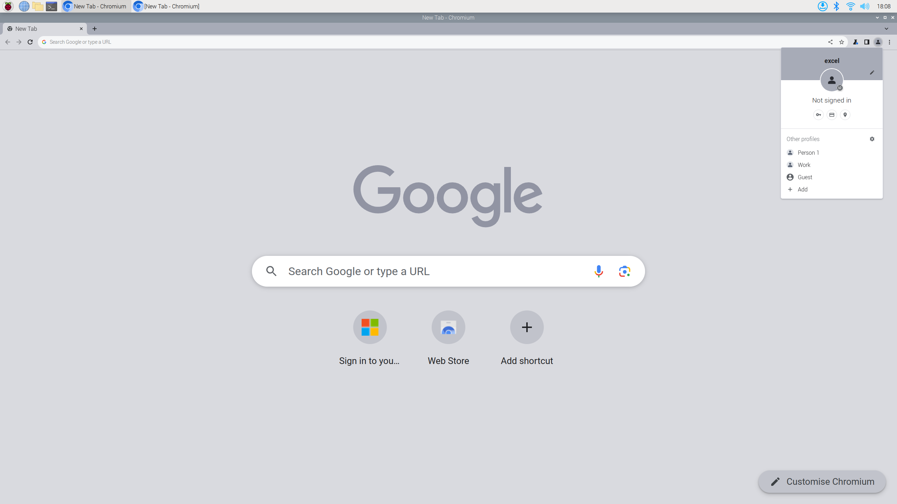

# Excel Autostart

## Alte Autostart-Skripte löschen

Das alte Skript im Autostart für Chrome wird nicht mehr benötigt. Mit dem Befehl kannst du es löschen:
```bash
sudo rm /etc/xdg/autostart/chromium.desktop
sudo rm /etc/xdg/autostart/firefox.desktop
```
(Kann sein, dass du die erste Datei ohne "p" erstellt hast; dann lass es auch im Befehl oben weg)

## Profil in Chrome anlegen & Autostarten

Öffne Chromium auf dem Pi und klicke oben rechts auf das Benutzericon --> Klicke auf "Add".


Dann geht ein neues Fenster und du kannst dem Profil einen Namen geben, am besten einfach "excel". Das Profil wird beim Autostart geladen und sollte damit auch Passwort und Zoom jedes Mal laden.

Jetzt musst du nur noch wie beim ersten Mal eine Datei für den Autostart anlegen mit 
```bash
nano ~/.config/autostart/excel-web.desktop
```
und den folgenden Inhalt einfügen:
```bash
[Desktop Entry]
Type=Application
Name=Excel Web
Exec=chromium-browser --profile-directory=excel --start-fullscreen --noerrdialogs --disable-crash-reporter --disable-infobars --app=LINK_HIER_EINFUEGEN
Terminal=false
Icon=chrome
```
(Falls du das Profil nicht "excel" genannt hast, musst du das hinter `--profile-directory=` `noch anpassen). Wenn du jetzt den Pi neustartest, dich bei Excel einloggst (am besten bei dieser Excel-Seite "Eingeloggt bleiben" auswählen und das Passwort auch in Chrome speichern) und den Zoom richtig einstellst, sollte das beim nächsten Start wieder genauso laden. Da das jetzt auch nicht mehr im Kiosk-Modus gestartet wird, kommst du mit F11 aus dem Vollbild raus.

## Mauszeiger verstecken

Um den Mauszeiger automatisch nach einer Bewegung auszublenden, installiere das Programm `unclutter` mit
```bash
sudo apt-get install unclutter
```
Dann musst du mit nano eine Datei öffnen:
```bash
nano /etc/xdg/lxsession/LXDE/autostart
```
und die folgende Zeile am Ende hinzufügen:
```bash
@unclutter -idle 0.1 -root
```
Nach einem Neustart sollte die Maus verschwinden, sobald sie nicht mehr bewegt wird.